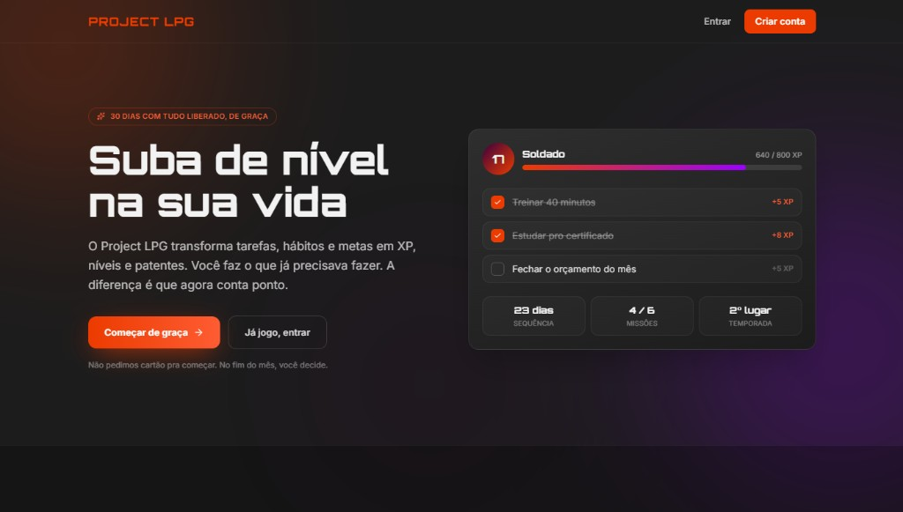
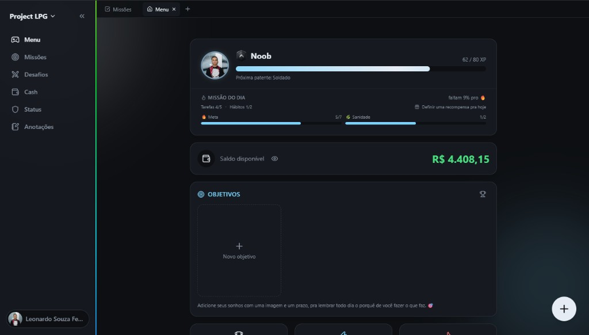
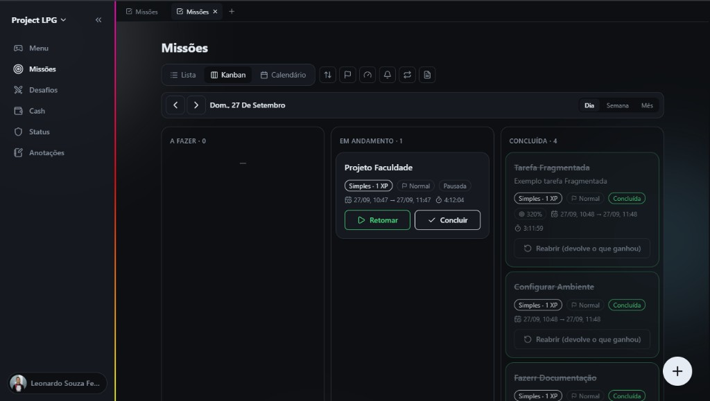
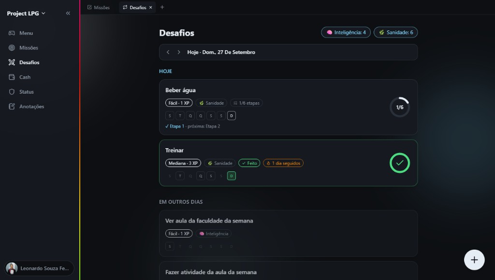
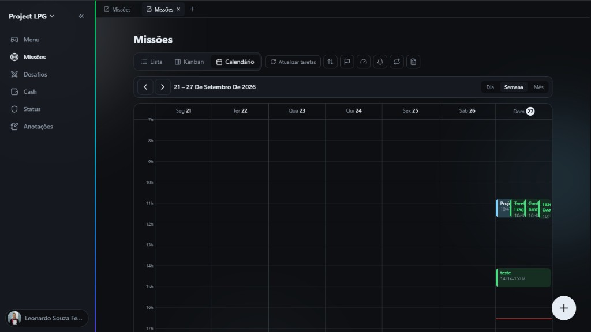

# Project LPG — Personal Operating System (POS)

Sistema de produtividade pessoal gamificada (*Life Playing Game*): um **POS** que junta missões, hábitos, dinheiro, treinos e um painel único — com análise financeira assistida por IA (exportação CSV + Gemini).

O sistema **já está no ar**. O professor **não precisa instalar nem rodar** o código: basta abrir os links abaixo, criar uma conta (ou entrar) e navegar.

### 🔗 Links úteis

- **Aplicação Web:** [https://projectlpg.com](https://projectlpg.com)
- **Google Play (Android):** [https://play.google.com/store/apps/details?id=com.projectlpg.app](https://play.google.com/store/apps/details?id=com.projectlpg.app)

Este README atende ao pedido da disciplina: descrição, ferramentas, fluxo de organização, prints e como utilizar.

---

## 1. Descrição do sistema

O **Project LPG** é um *Personal Operating System*: em vez de espalhar a vida em vários apps, o usuário concentra **o que fazer**, **o que repetir**, **o que gasta ou recebe** e **como está o progresso** no mesmo lugar.

A landing do produto deixa a proposta explícita: tarefas, hábitos e metas viram **XP, níveis e patentes** — a diferença passa a contar ponto.

**O que o sistema resolve**

- Rotina fragmentada (lista num lugar, extrato em outro, hábito só na cabeça).
- Procrastinação: o **modo foco (Pomodoro)** recorta o tempo da missão.
- Finanças sem leitura: lançamentos no app + **exportação CSV** + **Gemini** para relatório e decisão.
- Falta de um **dashboard**: o Menu mostra missão do dia, saldo, objetivos e XP.

**Módulos principais**

| Módulo no app | Função |
|---------------|--------|
| **Menu** | Painel: XP, missão do dia, saldo, objetivos |
| **Missões** | Tarefas em Lista, **Kanban** (A fazer / Em andamento / Concluído) e **Calendário** |
| **Desafios** | Hábitos (ex.: beber água, treinar) com XP, etapas e sequência |
| **Cash** | Financeiro: entradas, saídas, importar extrato, **exportar CSV** |
| **Status / Anotações** | Progresso e registro escrito |

Métodos embutidos: **Pomodoro** (foco na missão), **GTD** (capturar no sistema), priorização do que é do dia, **gamificação** (XP).

**IA (híbrida):** o LPG não “chuta” o orçamento sozinho. Ele exporta os lançamentos em `.csv`; o aluno envia o arquivo ao **Gemini** e recebe insights (receita × despesa, categorias, recomendações). Nada é apagado no app ao exportar.

---

## 2. Ferramentas utilizadas

### Linguagens
TypeScript, JavaScript (Node.js), SQL, HTML/CSS, Java (casca Android).

### Front-end e app
| Ferramenta | Uso |
|------------|-----|
| **React** + **Vite** | Interface web |
| **Tailwind CSS** | Visual |
| **PWA** | Uso pelo navegador / instalação |
| **Capacitor** | App Android |
| **Google Play** | Distribuição (`com.projectlpg.app`) |

### Servidor e dados
| Ferramenta | Uso |
|------------|-----|
| **AdonisJS v6** | API, login, regras de negócio |
| **PostgreSQL** | Banco de dados |
| **Lucid / VineJS** | ORM e validação |
| **Sessão (cookie)** | Login e-mail/senha ou **Google** |

### Operação e IA
| Ferramenta | Uso |
|------------|-----|
| **Git / GitHub** | Versionamento — [Leo-Ferrianci/LPG](https://github.com/Leo-Ferrianci/LPG) |
| **Yarn** | Pacotes |
| **Google Cloud (OAuth)** | Entrar com Google |
| **Stripe** | Planos no site |
| **CSV + Google Gemini** | Análise financeira e relatório de decisão |

---

## 3. Fluxo de organização

```
Usuário acessa projectlpg.com  (ou o app na Play)
        │
        ▼
   Cria conta / entra
        │
        ├── Menu ──────── painel (XP, missão do dia, saldo, objetivos)
        ├── Missões ───── Lista, Kanban ou Calendário + foco Pomodoro
        ├── Desafios ──── hábitos do dia e da semana
        ├── Cash ──────── lança / importa  →  Exportar CSV
        └── Anotações ─── registro escrito
                              │
                              ▼
                         arquivo .csv
                              │
                              ▼
                      Gemini (assistente IA)
                              │
                              ▼
                 Relatório: gargalos e recomendações
```

**Semana típica**

1. **Capturar** a missão ou o hábito no app (não deixar no chat).  
2. **Executar** no Kanban (A fazer → Em andamento → Concluído) ou no calendário; usar o cronômetro de foco.  
3. **Revisar** o Menu (missão do dia, XP, saldo).  
4. **Medir** o Cash; quando for decidir o mês, **Exportar**.  
5. **Decidir** com o Gemini e voltar só com as ações escolhidas.

---

## 4. Prints

Capturas do site [projectlpg.com](https://projectlpg.com).

### 4.1 Landing — proposta do POS

“Suba de nível na sua vida”: tarefas, hábitos e metas em XP; 30 dias para experimentar.



### 4.2 Menu — dashboard unificado

XP, patente, missão do dia (tarefas e hábitos), saldo disponível e objetivos.



### 4.3 Missões — Kanban

Colunas **A fazer**, **Em andamento** e **Concluído** (visão estilo Trello), com cronômetro de foco na missão.



### 4.4 Desafios — hábitos e rotina

Hábitos do dia (ex.: beber água, treinar) com XP, sanidade/inteligência e sequência.



### 4.5 Missões — calendário

Visão semanal da agenda: o que está marcado em cada horário.



---

## 5. Como utilizar a solução

### 5.1 Acessar (não precisa rodar o projeto)

O LPG já está publicado. Use os links oficiais:

- **Aplicação Web:** [https://projectlpg.com](https://projectlpg.com)
- **Google Play (Android):** [https://play.google.com/store/apps/details?id=com.projectlpg.app](https://play.google.com/store/apps/details?id=com.projectlpg.app)

1. Abra a **Aplicação Web** no navegador (ou instale pelo **Google Play**).  
2. Clique em **Entrar** ou **Criar conta** (e-mail/senha ou Google).  
3. Navegue pelo Menu, Missões, Desafios e Cash — os prints da seção 4 são dessas telas.

### 5.2 Usar o POS no dia a dia

| Quero… | Onde |
|--------|------|
| Ver o resumo do dia e o saldo | **Menu** |
| Organizar tarefas no quadro | **Missões → Kanban** |
| Ver a semana | **Missões → Calendário** |
| Manter hábito / treino | **Desafios** |
| Lançar ou analisar dinheiro | **Cash** → Importar / **Exportar** |
| Pedir análise à IA | Baixar o CSV e enviar ao **Gemini** |

### 5.3 Demonstração da IA (para a banca)

1. Em **Cash**, tenha alguns lançamentos (entrada e saída).  
2. Clique em **Exportar** (ao lado de Importar).  
3. Abra o Gemini, anexe `lpg-financeiro-AAAA-MM-DD.csv` e peça, por exemplo:

> Analise este extrato do Project LPG. Compare entradas e saídas, cite as categorias que mais pesam e sugira três ajustes. Não invente valores que não estejam no arquivo.

4. Mostre o relatório. Os dados **continuam** no LPG.

### 5.4 Outros links

| Recurso | URL |
|---------|-----|
| Planos | [projectlpg.com/planos](https://projectlpg.com/planos) |
| Privacidade | [projectlpg.com/privacidade](https://projectlpg.com/privacidade) |

---

## Relação com o enunciado

| Pedido do README | Seção |
|------------------|--------|
| Descrição do sistema | 1 |
| Ferramentas utilizadas | 2 |
| Fluxo de organização | 3 |
| Prints | 4 |
| Como utilizar a solução | 5 |

---

**Project LPG** — *Personal Operating System*  
Leonardo Souza Ferrianci

🔗 **Aplicação Web:** [https://projectlpg.com](https://projectlpg.com)  
🔗 **Google Play (Android):** [https://play.google.com/store/apps/details?id=com.projectlpg.app](https://play.google.com/store/apps/details?id=com.projectlpg.app)
